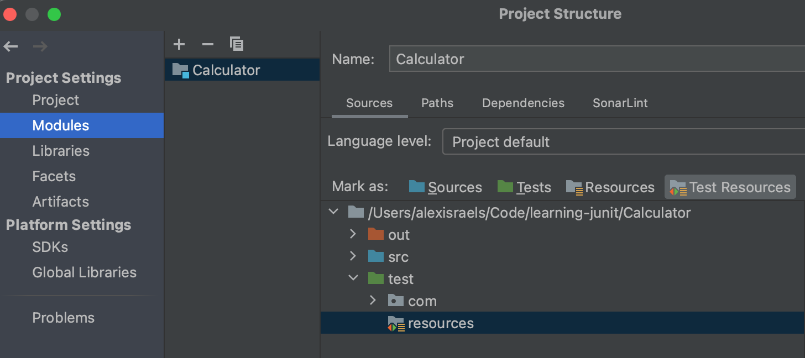
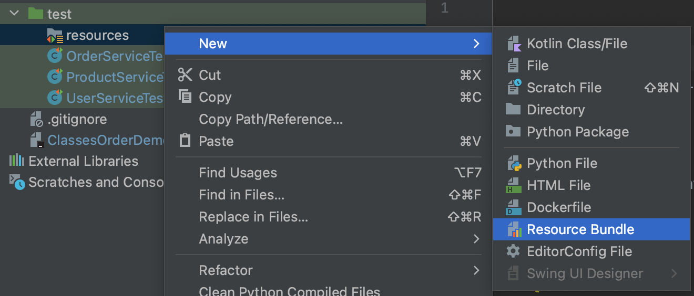
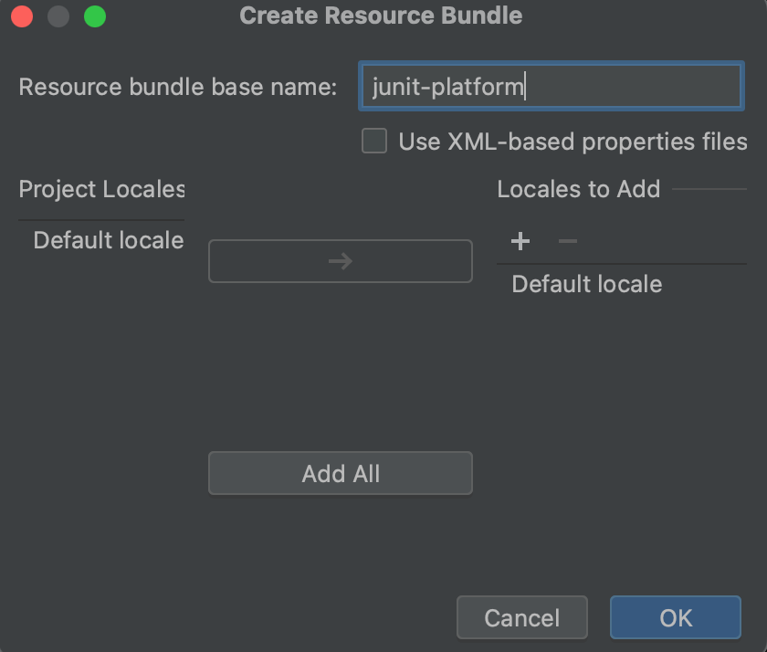

# Learning Junit Testing

## Course

This repository follows the course taught on [udemy](https://www.udemy.com/share/106yPY3@NCV-swCvDAd_lj7XoibM31mHnJfE6C9N3At-HdtpDA09JBahVWFW8AKOUm6NasPrSw==/)

## JUnit Notes

### F.I.R.S.T. Principle

1. Fast
2. Independent
3. Reliable
4. Self-validating
5. Thorough & Timely - Covers edge cases

### Unit Test Messages

Will always be evaluated even if the test passes.
Best practice is to use a lambda function so they only get evaluated on a failure.
This helps with performance in larger applications.

Example:
```java
    @Test
    void integerSubtraction() {
        Calculator calculator = new Calculator();
        int minuend = 33;
        int subtrahend = 1;
        int expectedResult = 32;

        int actualResult = calculator.integerSubtraction(33,1);
        assertEquals(expectedResult, actualResult,
                () -> minuend + " - " + subtrahend + " did not produce " + expectedResult);
    }
```

### Unit Test Naming Convention

Below is a common pattern for naming tests:

```
test<System Under Test>_<Condition or State Change>_<Expected Result>
```

So the integerDivision() test that checks if 4 / 2 = 2 would be:

```java
testIntegerDivision_WhenFourIsDividedByTwo_ShouldReturnTwo() {}
```

### Test Method Code Structure: AAA

A good practice is to arrange your test methods like the following:

```java
void test() {
    // Arrange

    // Act

    // Assert
}
```

Another common way this pattern is described is with Given, When, Then:

```java
void test() {
    // Given

    // When

    // Then
}
```

### Lifecycle Annotations

The following are the 4 lifecycle annotations provided by the JUnit Jupiter API

```java
@BeforeAll  // used for setup() and must be static
@BeforeEach // used for beforeEach() instance of a test method
@AfterEach  // used for afterEach() instance of a test method
@AfterAll   // used for cleanup() and must be static
```

### @Disabled Annotation:

Allows you to disable a unit test with a description and still keep it in the report:

```java
@Disabled("TODO: Still needs work")
```

### @ParameterizedTest

This annotation is used to indicate that the test accepts parameters.

#### @MethodSource

An additional annotation `@MethodSource` is used to specify which method will return the list of arguments to be passed as parameters.
The method referenced by `@MethodSource` must be `static`.

If the name of the method referenced by `@MethodSource` is the same as a test method name, we do not need to specify it in the annotation.

#### @CSVSource

A comma separated list of values to be passed as arguments to the method.

`''` will denote an empty string and `` nothing indicates a null value

```java
@CSVSource({
    "apple,orange", // passes "apple" and "orange" as strings
    "apple,''",     // passes "apple" and "" as a string and empty string
    "apple,"        // passes "apple" and null as string and null
})
```

#### @CSVFileSource

Allows you to specify a file with parameters to run multiple iterations of a test method.
The path is based at the root of the test resources directory.

```java
@CSVFileSource("/paramaters.csv")
```

#### @ValueSource

Can only be used for testing a method with a single parameter. Allows you to pass a list of arguments into your test method.

```java
@ParameterizedTest
@ValueSource(strings = {"John", "Kate", "Alice"})
void valueSourceDemonstration(String firstName) {
    System.out.println(firstName);
    assertNotNull(firstName);
}
```

### @RepeatedTest

Allows you to test a method multiple times. JUnit also provides some objects that you can inject into the method that can tell you what 
iteration you're on and some metadata for the current test.

```java
@DisplayName("Test division by zero")
@RepeatedTest(value=3, name="{displayName}: Repetition {currentRepetition} of " +
    "{totalRepetitions}")
void testIntegerDivision_WhenDividendIsDividedByZero_ShouldThrowArithmeticException(
        RepetitionInfo repetitionInfo,
        TestInfo testInfo
) {
    System.out.println("Running " + testInfo.getTestMethod().get().getName());
    System.out.println("Repetition #" + repetitionInfo.getCurrentRepetition() +
            " of " + repetitionInfo.getTotalRepetitions());

    // Rest of test ...

}
```

### Run Tests in a Random Order

Allows you to run test in a random order:

```java
@TestMethodOrder(MethodOrderer.Random.class)
public class MethodOrderedRandomlyTest {
}
```

### Run Tests by Name

Allows you to run tests in order by name:

```java
@TestMethodOrder(MethodOrderer.MethodName.class)
public class MethodOrderedByNameTest {
}
```

### Run Tests by Index

Allows you to run tests in order by index:

```java
@TestMethodOrder(MethodOrderer.OrderAnnotation.class)
public class MethodOrderedByOrderIndexTest {

    @Order(1)
    @Test
    void testB() {
        System.out.println("Running test B");
    }

    @Order(2)
    @Test
    void testA() {
        System.out.println("Running test A");
    }
}
```

### Run Test Classes in Order by Index

You can configure ordering similarly for classes using a `junit-platform.properties` file.

```properties
junit.jupiter.testclass.order.default=org.junit.jupiter.api.ClassOrderer$OrderAnnotation
```

### Changing Test Instance Lifecycle

By default when testing a new instance of the test class is instantiated for each test method. This keeps tests isolated.
We can change this to allow the sharing of state within the test class with the following annotation:

```java
@TestInstance(TestInstance.Lifecycle.PER_CLASS)
```

When you change the Test Instance Lifecycle to per class, then methods annotated with `@BeforeAll` and `@AfterAll` are no longer `static`.

## Other

### TDD Flow

The process for test driven development is as follows:

1. Write Test unti it doesn't compile

    1a. Write application code until test compiles

2. Run test (should be red)

3. Update application code and run test until it passes

4. Refactor tests and application code

5. Repeat till application is done

### Set Test Resources Root

First create a `resources` package inside your `test` folder.
Then right click at the base of the project in IntelliJ and select `Open Module Settings`. You should then see an screen like the following:



Select the `resources` package you created and then click the Test Resources button at the top and click apply.

### Create JUnit Properties

First make sure you've created and configured your `resources` package.
Then right click the package and select `Resource Bundle` as shown below:



Then enter 'junit-platform' as the resource bundle base name:


### Maven Surefire Plugin

It appears that the surefire plugin is part of the JUnit Aggregator dependency, but it is not the latest version of the plugin

Build command:

```bash
mvn package
```

Test command:

```bash
mvn test
```

Build without tests:

```bash
mvn package -Dmaven.test.skip=true
```

